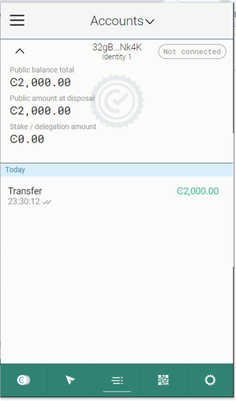

# Concordium-Hackathon-Task-1


Mainnet Address: 

## Windows setup developer environment

# Rust and Cargo install

- First install rust from https://rustup.rs

.png)

- Proceed installing wasm using the following command:

```rustup target add wasm32-unknown-unknown```
.png)
- Once installed, download and install the Concordium software package from https://developer.concordium.software/en/mainnet/net/installation/downloads-testnet.html#cargo-concordium-v2-7-0
- Rename the file from cargo-concordium-v.x.x to cargo-concordium.
- This tool should be placed in the PATH. This can be achieved by moving the executable to a folder that is already on the PATH, %HOMEPATH%\.cargo\bin\ for the windows case.
- If everything is correct, when you enter the command ```cargo concordium --help``` you should see something like this:
.png)
- Install the Concordium Client from https://developer.concordium.software/en/mainnet/net/installation/downloads-testnet.html#concordium-node-and-client-download-testnet
.png)

# Setup a wallet
- Now you need a Concordium wallet. Use the Concordium Wallet for Web. The Concordium Wallet for Web uses a 24-word secret recovery phrase to secure your wallet. Make sure to protect your 24-word secret recovery phrase and store it in a secure place. Anyone who knows the secret recovery phrase can access your wallet.
Use this link to install a Concordium Wallet for Web: https://chrome.google.com/webstore/detail/concordium-wallet/mnnkpffndmickbiakofclnpoiajlegmg?hl=en-US
- Install the extension. Configure it to run on testnet with an identity created from the Concordium testnet IP (shown below) and an account based on that identity.
- Use the Testnet faucet in your account to claim 2000 CCDs for testing purposes.
When you have created your account and claimed your CCD, you will need to export the keys from your wallet. Save the file on your local machine in the same folder as the rest of the repository. It will have a name like this  <YOUR PUBLIC ADDRESS>.export. You can open it with a text editor and see your signKey and verifyKey in there. 

#Import the key
- You are ready to import the key into the concordium-client configuration. Move your <YOUR PUBLIC ADDRESS>.export to the path where you are running your concordium-client tool. Navigate to the folder as well.
- Import your key into the concordium-client configuration:
```concordium-client config account import <YOUR PUBLIC ADDRESS.export> --name <Your-Wallet-Name>```
- Where <Your-Wallet-Name> is the name that you want to give to your wallet, which is the name you can use later when interacting with the account through the client.
- And done, you should see something like this:
.png)

## concordium mainnet address

33QWpDeVfHqwk8PBVqVPvoQLNVDXauvig4BhKNTXjjKCGnyjpk
